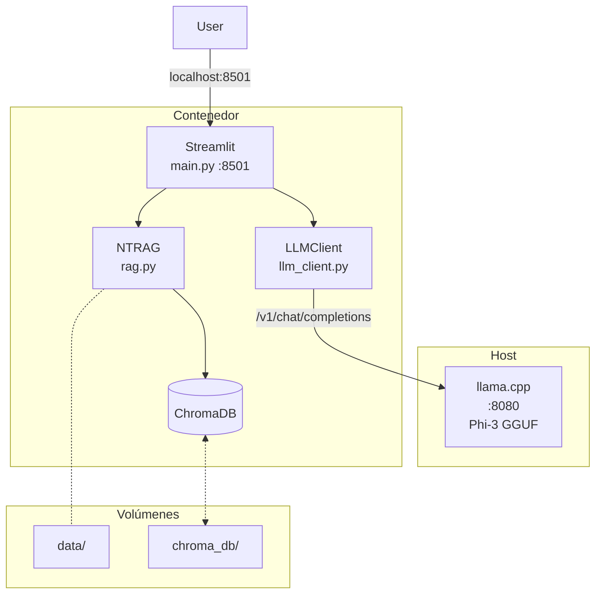
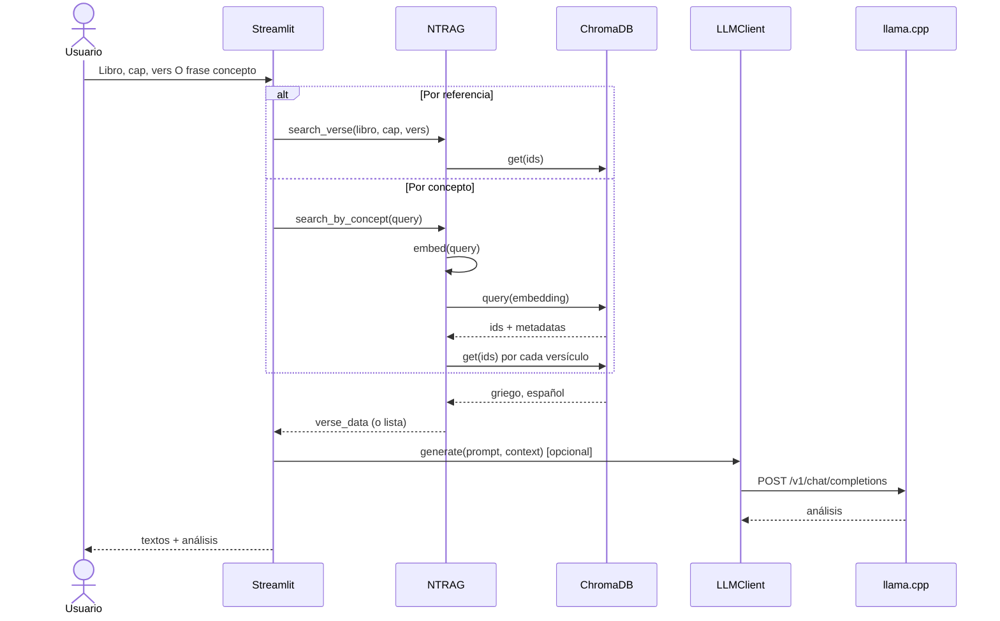
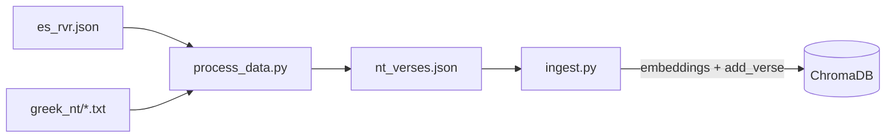

# Arquitectura NT Language Lab

## Vista del sistema

- **Host**: llama.cpp sirve el modelo GGUF (puerto 8080, API OpenAI). No corre en Docker.
- **Contenedor**: Streamlit (UI), NTRAG (búsqueda por referencia y por concepto/semántica), LLMClient (HTTP al LLM), ChromaDB (lectura en runtime).
- **Volúmenes**: `data/` (fuentes + nt_verses.json), `chroma_db/` (persistencia).

---

## Flujo de uso

**Por referencia:** Usuario elige libro/cap/vers → `search_verse()` → ChromaDB get(ids) → un versículo → (opcional) LLM comparación.

**Por concepto:** Usuario escribe frase → `search_by_concept()` (embedding + ChromaDB query por similitud) → lista de versículos → usuario elige uno → mismo detalle y opcional LLM.

---

## Pipeline de datos (una vez)

- **process_data.py**: Normaliza RVR + griego → `nt_verses.json`.
- **ingest.py**: Carga NTRAG (modelo de embeddings), lee `nt_verses.json`, escribe en ChromaDB. La app no ejecuta estos scripts.

---

## Stack

| Capa      | Tecnología                    |
|-----------|-------------------------------|
| UI        | Streamlit                     |
| Búsqueda  | ChromaDB (por ID y por similitud) |
| Embeddings| sentence-transformers (ingest + búsqueda por concepto) |
| LLM       | llama.cpp (host, :8080)       |
| Datos     | JSON → nt_verses.json         |
